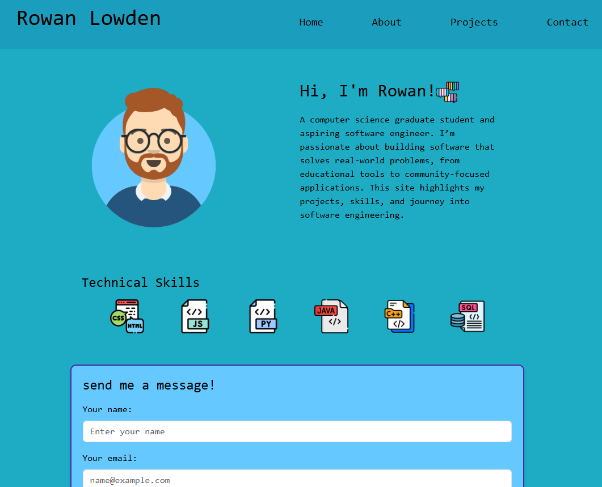
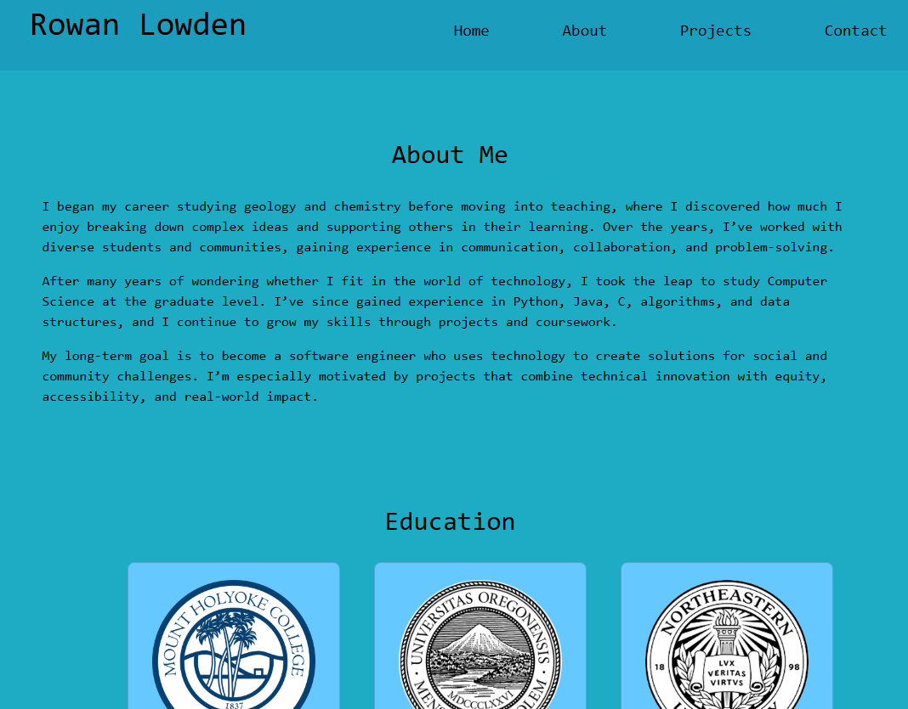
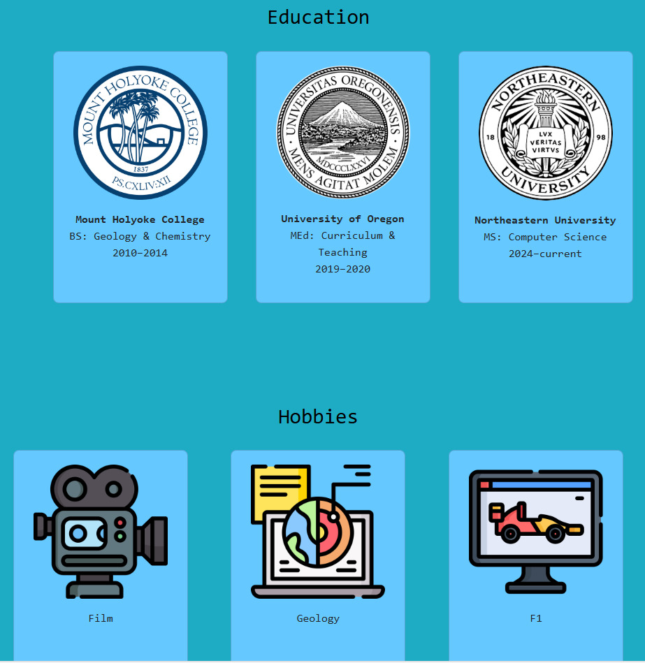
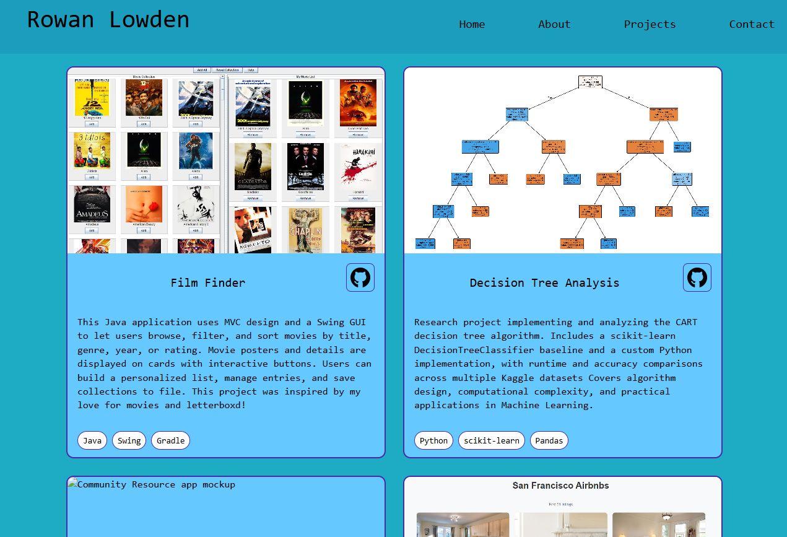

# Rowan Lowden's Personal Website

## Author

Name: Rowan Lowden
Class: 5610 Web Development

## Relevant Links

[Personal Website](https://rlowden22.github.io/index.html)
[Class Link](https://johnguerra.co/classes/webDevelopment_online_fall_2025/)
[Design Document](/designdocument.md)
[Google Slides](https://docs.google.com/presentation/d/1D8rX4cNo69FFYShDdj_6wjJWa_Fz4-i1bprVg1gp-Eg/edit?usp=sharing)
[Video Demo](path/to/file.md)

## Project Objective

The objective of this project is to practice my webdevelopment skills and create myself a personal website to communicate my background, interests, skills, personal coding projects, and contact information. The goal is a simple, yet fun design that is visually appealing to visitors, user friendly, and adaptable to various devices. It is built using HTML5, CSS3, Bootstrap5, and JavaScript, the homepage presents clear and organized information, catering to students, industry professionals, and potential collaborators.

## Features

- Responsive Layout – Works seamlessly across desktop, tablet, and mobile devices.
- Custom CSS + Flex/Grid – Hand-built styling without relying entirely on frameworks.
- Consistent Header & Footer – Uniform navigation and footer elements across all pages.
- Home Page – Intro section with avatar image swap on hover and technical skills icons.
- About Page – Multi-section layout with biography, education, and hobbies presented in card grids.
- Projects Page – Grid of project cards including title, image, description, tech stack, and GitHub links.
- Contact Form – Styled Bootstrap form with custom form-box container.
- Accessible Design – Semantic HTML5 structure, alt text for images, and smooth scrolling.
- Interactive JavaScript – Avatar image changes on hover.

## Screenshots

  
  
  

## Technology Stack

- HTML5 – Semantic markup for structure and accessibility.
- CSS3 – Custom styling with Flexbox and CSS Grid for responsive layouts.
- Bootstrap 5 – Utility classes and components (form, grid responsiveness).
- JavaScript (ES6 Modules):
  - DOM manipulation for interactive elements.
  - Avatar hover swap feature.
- Node.js + npm – For project configuration and ESLint setup.
- ESLint + Prettier – Code linting and consistent formatting.
- GitHub Pages – Hosting and deployment of my personal website.

## Instructions

- Project available at [Personal Website](https://rlowden22.github.io/index.html)

## Use of AI

As per the assignment, the code for one page is created using AI, its the Projects page. I used the following prompt while also submitting a screenshot of the original design:

"Please help me put together the html and CSS for my projects page. I already inserted the header and footer I wrote for the first two pages. I want the projects page to be simple, a grid layout with two columns and two rows to show 4 projects. Each card will have the project title, an image of it, a short description, the tech stack listed, and a link to the github repo as the github icon."

For the most part it worked, I adjusted the picture size, the fit of the picture, updated the link to a github logo, changed the colors, added my pictures, etc.

I also used AI to help me better understand the eslint configuration, how to intall and run ESLint, and write this readme.

## License

This project is licensed under the [MIT License](/LICENSE)

## Other Resources Used

-[FreePix Flat Icons](https://www.flaticon.com/authors/freepik) -[Formspree](https://formspree.io/)
