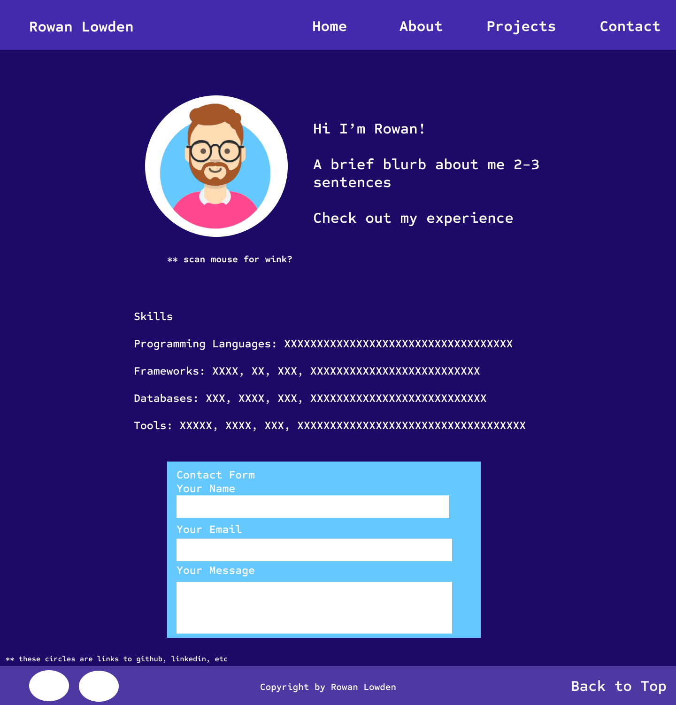
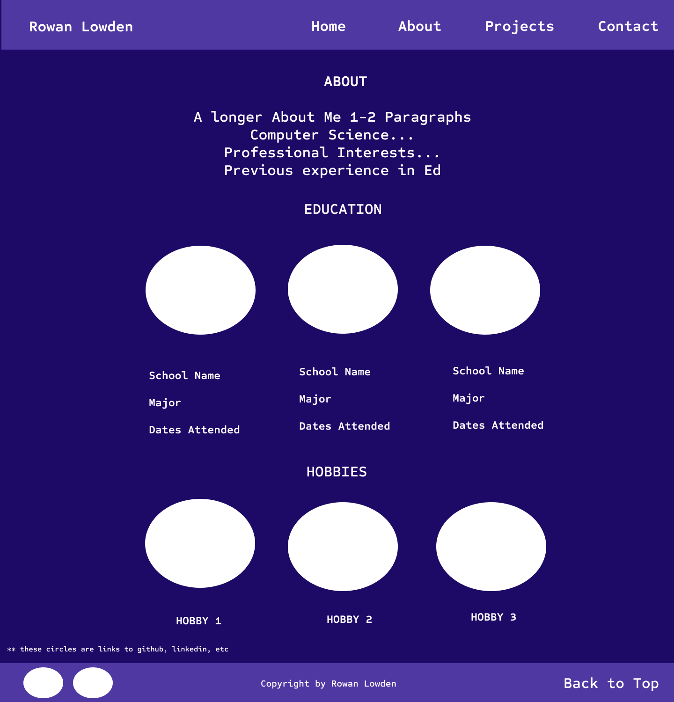
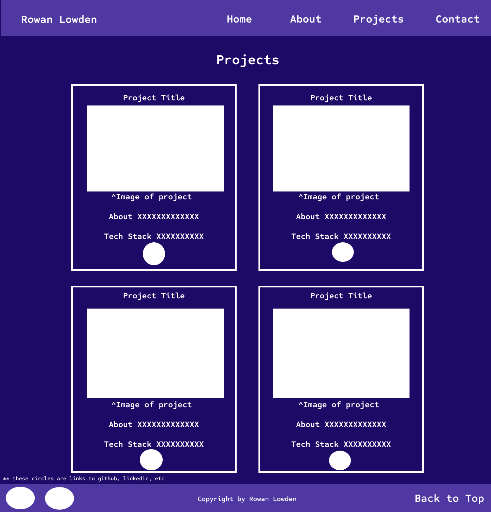

# Rowan Lowden's Personal Website Design Document

## Project Description
The purpose of this project is to create myself a personal website to communicate my background, interests, technology skills, personal coding projects, and contact information. The goal is a simple, yet fun design that is visually appealing to visitors, user friendly, and adaptable to various devices. It is built using HTML5, CSS3, Bootstrap5, and JavaScript, the homepage presents clear and organized information, catering to students, industry professionals, and potential collaborators.

I plan on having 3 HTML pages: 
- Homepage with an avatar of myself, a brief welcome message, a list of skills, and a contact form at the bottom. 
- About Page with a longer about me, education, and hobbies
- The third page is for Projects highighting 4 recent personal projects from the last year with titles, images, tech used, and link to github repos.

Each page will have the same header and footer. They will include:
- The header will have my full name of the left and a navigation bar on the right (Home, About, Projects, Contact)
- The footer will have 2 links to (github, linkedin), copyright in the middle, and a back to top button on the right. 

A key feature that differentiaties my homepage from others is the main avatar image on the homepage switches from an image of me smiling with a blue shirt to me winking with a pink shirt. 

## User Personas & Stories

### User Persona 1: Tech Recruiter
- Name: Avery Chen
- Background: high volume tech recruiter
- Goals: evaulate Rowan's technical skills and projects for potential employment opprtunties
- Story: Avery is a high-volume tech recruiter who needs to decide in under a minute if Rowan is a fit for open roles. She looks for a clear about-me summary, 2–3 featured projects with established github repos with clear READMEs showing objectives, technical skill, and impact. If the signal is strong, she forwards his resume to a hiring manager.

### User Persona 2: CS student 
- Name: Sam Patel
- Background: CS graduate student at NU
- Goals: explore fellow students projects and personal website
- Story: Sam is also a CS graduate student at Northeastern University browsing peers’ sites to learn from real projects and spot potential collaborators. He wants a clear overview, tech stack, and a quick-start guide so he can clone and run my projects quickly. If it’s well-documented and active, he might star the repo or reach out to pair on a feature.
  
### User Persona 3: Staff Engineer
- Name: Jordan Kim
- Background: highly knowledgeable and skilled Staff Engineer in tech
- Goals: skims Rowan's website for quality, design, login/reasoning, testing, and maintainability
- Story: Jordan is a seasoned staff engineer who skims Rowan’s site to quickly gauge engineering rigor: clear architecture diagrams, documented design decisions, and rationale behind trade-offs. They check for tests and continuous integration status, readable code structure, and maintainability (modularity, naming, performance notes). If the reasoning is and quality is evident, they’ll bookmark the project and consider it for a strong reference or referral.

## Design WireFrames

### HomePage
    

### About 
    

### Projects
    